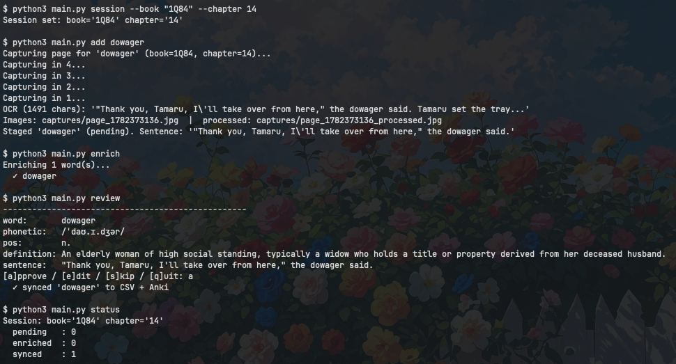
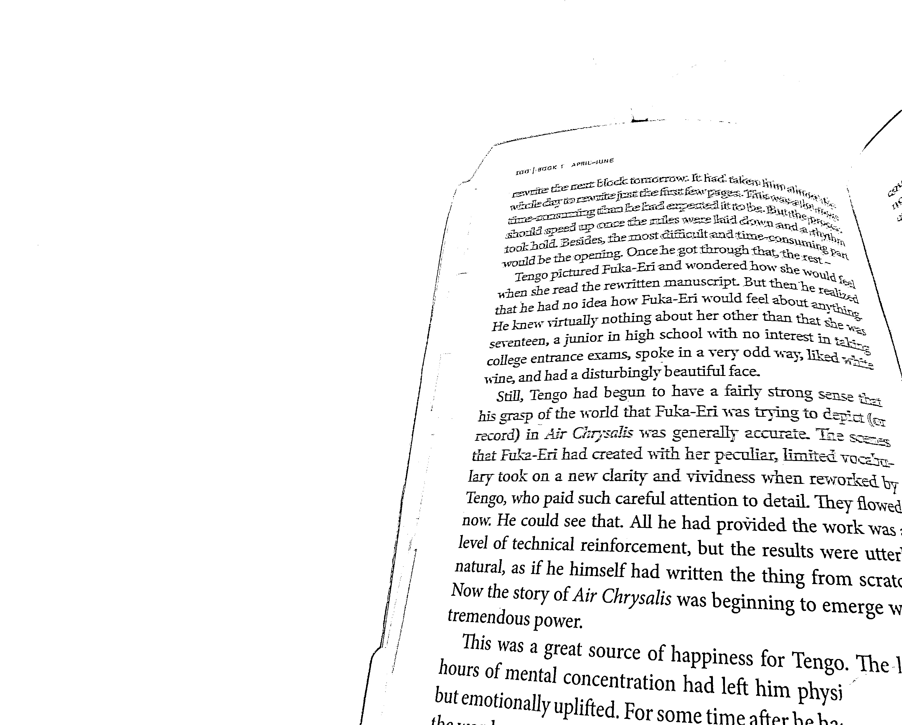
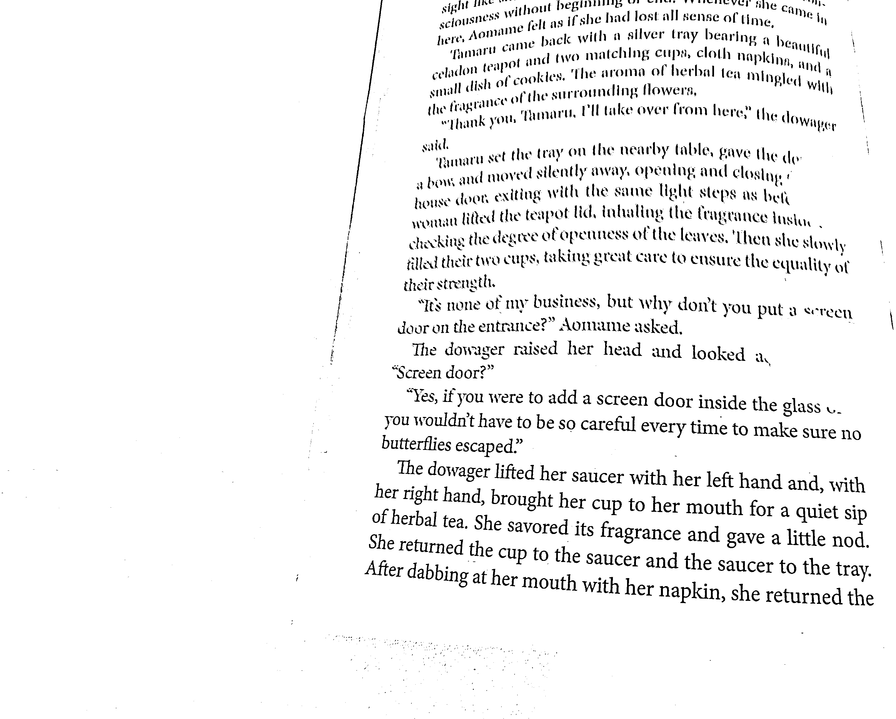
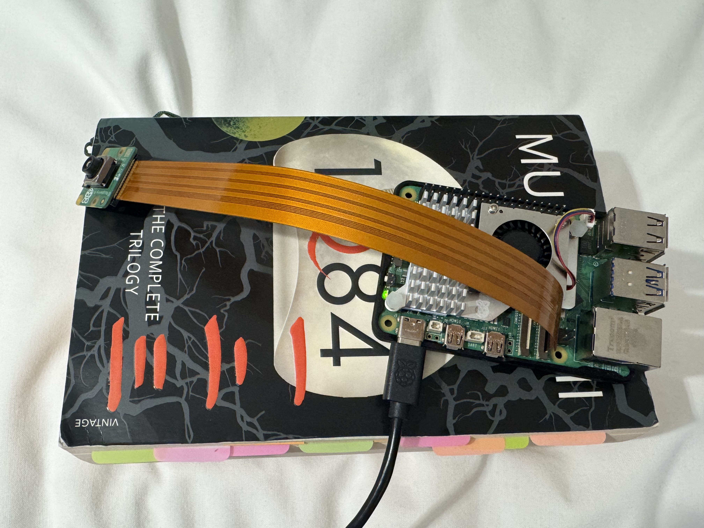

# About this project

A command-line tool that runs on a **Raspberry Pi 5** to capture unknown words while reading physical books. Type a word, the Pi photographs the page, OCRs it, finds the sentence, gets a context-correct definition from Claude, and pushes the result to a CSV log and Anki.

This project is a direct sequel to and is heavily inspired by my previous project, [vocab-apps-script](https://github.com/Neilos-Thumm/vocab-apps-script)

---

## Hardware

- Raspberry Pi 5
- Raspberry Pi Camera Module 3
- MicroSD card with Raspberry Pi OS (Bookworm)
- A computer to SSH from

---

## One-Time Pi Setup

### 1. Connect to the internet

For home WiFi, use the desktop WiFi icon. For enterprise/university WiFi (WPA2-Enterprise):

```
Authentication: PEAP
Inner auth: MSCHAPv2
CA certificate: None
```

A phone hotspot is simpler if enterprise WiFi causes issues.

### 2. Enable SSH

```bash
sudo raspi-config
# Interface Options → SSH → Enable
```

### 3. Set up SSH key authentication from your computer

```bash
ssh-keygen -t ed25519
ssh-copy-id <username>@<pi-ip>
```

Add a shortcut to `~/.ssh/config`:

```
Host pi
    HostName <pi-ip>
    User <username>
```

Now `ssh pi` connects without a password.

### 4. Install dependencies on the Pi

```bash
sudo apt install tesseract-ocr -y
mkdir -p ~/TranslatingTools && cd ~/TranslatingTools
python3 -m venv venv --system-site-packages
source venv/bin/activate
pip install opencv-python-headless pytesseract anthropic
pip uninstall numpy -y   # use system numpy to avoid ABI conflict with picamera2
```

### 5. Set your Anthropic API key

```bash
echo 'export ANTHROPIC_API_KEY=your-key-here' >> ~/.bashrc
source ~/.bashrc
```

### 6. Copy vocab.py to the Pi

```bash
scp vocab.py <username>@<pi-ip>:~/TranslatingTools/
```

### 7. Verify the camera

```bash
libcamera-hello --list-cameras
```

---

## Daily Workflow

```bash
ssh pi
cd ~/TranslatingTools && source venv/bin/activate
```

**Set session context once per book:**
```bash
python3 main.py session --book "1Q84" --chapter 7
```

**Capture a word:**
```bash
python3 main.py add dowager
# 4-second countdown → camera fires → OCR → sentence found → staged
```

Sentence matching has three paths:
- One match → auto-selected
- Multiple matches → pick from a numbered list
- Zero matches → paste the sentence manually (always works regardless of OCR quality)

**Check progress:**
```bash
python3 main.py status
```

**Enrich with Claude:**
```bash
python3 main.py enrich
# Sends each pending word + sentence to the Anthropic API
# Returns phonetic (IPA), part of speech, context-correct definition
```

**Review and sync:**
```bash
python3 main.py review
# [a]pprove / [e]dit / [s]kip / [q]uit
# On approve: writes to vocab_log.csv and pushes to Anki via AnkiConnect
```

> Anki runs on your main computer, not the Pi. Point `ANKI_CONNECT_URL` at its LAN IP, or run `vocab review` from your main computer directly.

---

## Tuning OCR

```bash
python3 main.py capture-test   # fires camera, prints OCR output, no DB write
```

Download the processed image to inspect:

```bash
scp "<username>@<pi-ip>:$(ssh <username>@<pi-ip> 'ls -t ~/TranslatingTools/captures/*_processed.jpg | head -1')" ~/Downloads/
```

**Tuning parameters in `preprocess()` in `vocab.py`:**

| Parameter | Effect |
|---|---|
| `CROP_LEFT`, `CROP_RIGHT` | Crop to a single page — adjust for your camera position |
| `blockSize` (31) | Larger = smoother threshold |
| `C` (15) | Larger = more background suppression |
| `LensPosition` | Manual focus in dioptres (~4.0 ≈ 25cm) |

---

## Word Lifecycle

```
pending → enriched → synced
```

Words are never enriched twice (API cost control).

---

## Anki Note Format

**Note type:** Basic (and reversed card)  
**Front:** `dowager (n.) | /ˈdaʊ.ɪ.dʒər/`  
**Back:** context-correct definition

---

## Tech Stack

| Concern | Tool |
|---|---|
| Camera | picamera2 |
| Image preprocessing | OpenCV |
| OCR | Tesseract via pytesseract |
| Staging | SQLite |
| Permanent log | CSV |
| Enrichment | Anthropic API |
| Anki sync | AnkiConnect HTTP API |
| CLI | argparse |

---

## File Structure

```
TranslatingTools/
├── main.py           # main script
├── vocab.db          # SQLite staging database (auto-created)
├── vocab_log.csv     # permanent chronological log (auto-created)
└── captures/         # raw and processed images (auto-created)
```


## Demo

### Success Output


### Success processed image capture




### Hardware


